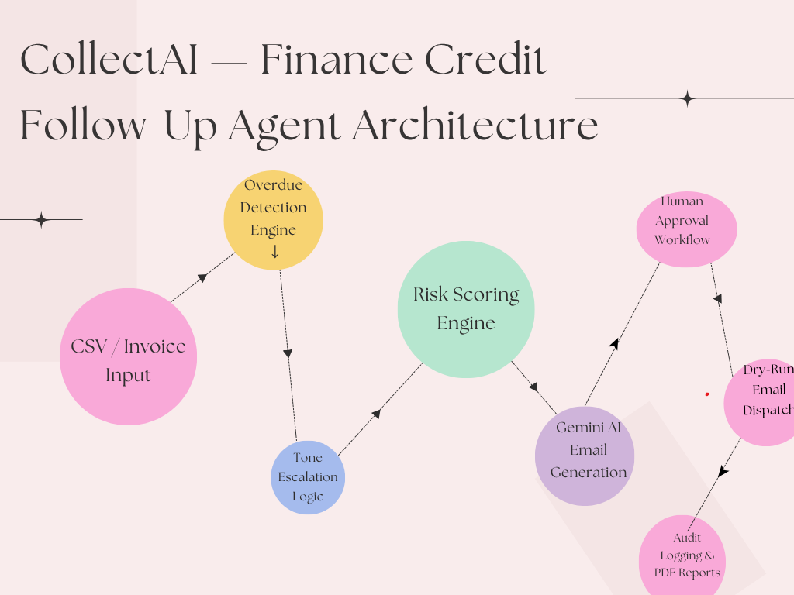

Future Enhancement:
APScheduler can automate daily invoice scanning and email dispatching at scheduled intervals.


# 💼 CollectAI — Finance Credit Follow-Up Agent

## Overview

CollectAI is an AI-powered finance recovery assistant that automates overdue invoice follow-up workflows using Gemini AI and LangChain.

The system:
- detects overdue invoices
- selects escalation tone automatically
- generates AI-powered follow-up emails
- supports dry-run email sending
- logs all activities for audit compliance
- escalates severe cases to legal/manual review

---

# Features

## ✅ Data Ingestion
- CSV invoice upload
- pandas-based processing
- overdue detection

## ✅ Tone Escalation Engine
Automatically selects communication tone:

| Stage | Overdue Days | Tone |
|---|---|---|
| 1st Follow-Up | 1–7 | Warm & Friendly |
| 2nd Follow-Up | 8–14 | Polite but Firm |
| 3rd Follow-Up | 15–21 | Formal & Serious |
| 4th Follow-Up | 22–30 | Stern & Urgent |
| Escalation | 30+ | Legal Review |

---

## ✅ AI Email Generation
Uses Gemini 2.0 Flash via LangChain to generate:
- personalized payment reminders
- stage-aware escalation emails
- dynamic invoice content

---

## ✅ Risk Scoring
Invoices are classified into:
- LOW
- MEDIUM
- HIGH risk

based on:
- invoice amount
- overdue days
- reminder count

---

## ✅ Human Approval Workflow
Finance users can:
- Approve
- Reject
- Escalate

before sending emails.

---

## ✅ AI Call Reminder Script
The system generates finance recovery call scripts automatically.

---

## ✅ Audit Logging
Every email action is logged with:
- timestamp
- invoice details
- stage
- tone
- risk
- send status

---

## ✅ Streamlit Dashboard
Interactive UI includes:
- metrics
- charts
- invoice queue
- AI email workspace
- audit logs

---

# Tech Stack

| Layer | Technology |
|---|---|
| LLM | Gemini 2.0 Flash |
| Framework | LangChain |
| Data Processing | pandas |
| UI | Streamlit |
| Visualization | Plotly |
| Logging | JSON audit logs |
| Email Sending | Dry-run SMTP simulation |

---

# Architecture Diagram



# Project Structure

```text
finance-followup-agent/
│
├── app/
├── data/
├── logs/
├── diagrams/
├── README.md
├── technical_disclosures.md
└── requirements.txt


# Installation

## 1. Clone Repository

```bash
git clone <repo-url>
cd finance-followup-agent
```

## 2. Create Virtual Environment

```bash
python -m venv venv
```

## 3. Activate Environment

### Windows

```bash
venv\Scripts\activate
```

## 4. Install Dependencies

```bash
pip install -r requirements.txt
```

## 5. Configure Environment Variables

Create `.env`

```env
GEMINI_API_KEY=your_api_key_here
```

## 6. Run Application

```bash
cd app
streamlit run main.py
```


## Security Risk Mitigation

| Risk | Description | Mitigation Used in This Project |
|---|---|---|
| Prompt Injection | A malicious invoice/client field could try to change the AI instructions. | The system prompt tells the LLM to use only provided invoice data and never invent details. Email output is validated before use. If required invoice fields are missing, the app falls back to a safe template email. |
| Data Privacy / PII | Invoice data contains client names, email addresses, amounts, and payment links. | Emails are masked in the dashboard. The app uses only required invoice fields. No real emails are sent in demo mode. Audit logs avoid unnecessary sensitive content. |
| API Key Exposure | Gemini API key could be leaked if hardcoded. | API keys are stored in `.env` using `python-dotenv`. `.env` is excluded from GitHub using `.gitignore`. An `.env.example` file is provided instead. |
| Hallucination Risk | The LLM may generate incorrect invoice details or generic emails. | The prompt requires exact invoice fields. A validation function checks client name, invoice number, amount, days overdue, and payment link in the generated email. If validation fails, fallback email is used. |
| Unauthorised Access | Anyone could open the dashboard and trigger email generation. | A simple login page is implemented with username/password. Session state controls access. A request counter limits excessive usage. |
| Email Spoofing / Accidental Sending | Real clients could accidentally receive emails during testing. | The project uses dry-run/sandbox mode only. No real emails are sent. Human approval is required before simulated sending. In production, verified sender domain, SPF, DKIM, and DMARC should be configured. |